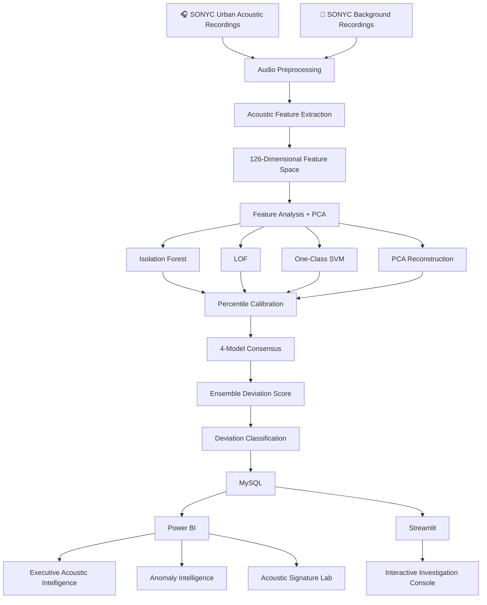

<div align="center">

# 🎧 EDGE-BASED AMBIENT MICRO-ACOUSTIC ANOMALY PROFILER

### Turning ambient urban sound into interpretable acoustic intelligence.

<p>
  <b>Software-Defined Acoustic Intelligence • Multi-Model Anomaly Detection • Spatiotemporal Investigation</b>
</p>

---

## 🚀 Live Demo

<div align="center">

### 🖥️ Try the Interactive Acoustic Intelligence Console

<a href="https://gradtwin-project-s42qzgeh95fr37wtnp6kde.streamlit.app/" target="_blank">
  
</a>

<br><br>

**Explore the interactive anomaly investigation console powered by Streamlit, MySQL and multi-model acoustic analysis.**

</div>

---


<br>


<br><br>


</div>

---

## 🌐 Project Vision

> **What if an acoustic environment could learn its own background profile — and then identify when that acoustic environment begins to behave differently?**

The **Edge-Based Ambient Micro-Acoustic Anomaly Profiler** is a software-defined acoustic intelligence system designed to analyze environmental audio, learn a background acoustic profile, and identify recordings that significantly deviate from that learned profile.

Instead of relying on a single threshold or a single machine-learning algorithm, the system combines **four complementary anomaly-detection approaches** and converts their outputs into a unified deviation profile.

The resulting intelligence is exposed through two complementary interfaces:

- 📊 **Power BI** — analytical reporting and executive investigation
- 🖥️ **Streamlit** — interactive application and recording-level investigation

The entire system is designed to operate as a **software-only edge-intelligence simulation**, requiring no physical acoustic hardware.

---

# 🧠 What Does the System Actually Do?

```text
                 AMBIENT ENVIRONMENTAL AUDIO
                              │
                              ▼
                  ┌──────────────────────┐
                  │  AUDIO PREPROCESSING  │
                  └──────────┬───────────┘
                             │
                             ▼
                  ┌──────────────────────┐
                  │ ACOUSTIC EXTRACTION  │
                  │      126 FEATURES    │
                  └──────────┬───────────┘
                             │
                             ▼
             ┌─────────────────────────────────┐
             │       ANOMALY MODEL LAYER       │
             │                                 │
             │  Isolation Forest               │
             │  Local Outlier Factor           │
             │  One-Class SVM                  │
             │  PCA Reconstruction             │
             └───────────────┬─────────────────┘
                             │
                             ▼
                  ┌──────────────────────┐
                  │  SCORE CALIBRATION   │
                  │  + MODEL CONSENSUS  │
                  └──────────┬───────────┘
                             │
                             ▼
                  ┌──────────────────────┐
                  │ ACOUSTIC DEVIATION   │
                  │      PROFILER        │
                  └──────────┬───────────┘
                             │
                 ┌───────────┴───────────┐
                 ▼                       ▼
          ┌──────────────┐        ┌──────────────┐
          │    MySQL     │        │   Analytics  │
          │ Data Layer   │        │    Layer     │
          └──────┬───────┘        └──────┬───────┘
                 │                       │
                 ▼                       ▼
          ┌──────────────┐        ┌──────────────┐
          │  Streamlit   │        │   Power BI   │
          │ Application  │        │  Intelligence│
          └──────────────┘        └──────────────┘
```

---

# 🎯 Core Problem

Urban environments contain multiple overlapping acoustic sources:

- 🚗 Engines
- 🚧 Machinery
- 🛠️ Powered equipment
- 🚨 Alert signals
- 🎵 Music
- 🗣️ Human voice
- 🐕 Dogs
- 🌆 General environmental background

A conventional rule-based system would require manually defining rules for every possible acoustic situation.

This project takes a different approach:

```text
Learn the background
        ↓
Understand its acoustic structure
        ↓
Measure deviations
        ↓
Compare multiple anomaly perspectives
        ↓
Prioritize unusual recordings
```

The objective is therefore not simply:

> **"What sound is this?"**

but rather:

> **"How different is this acoustic environment from the background profile it learned?"**

---

# 🔬 Research Interpretation

The project treats **anomaly** operationally as an acoustic deviation from a learned urban-background distribution.

A high deviation score means that the recording lies unusually far into the upper tail of the calibrated model-score distribution.

### Important scientific distinction

> A high deviation score is an **acoustic deviation candidate** — it is not proof of a harmful event, illegal activity, or confirmed noise violation.

The system is therefore designed as an **acoustic profiling and investigation system**, rather than a ground-truth event detector.

---

# 🗂️ Dataset Foundation

## Primary Dataset

### SONYC-UST v2.3

The primary urban acoustic dataset is **SONYC-UST v2.3**, developed for urban sound tagging using recordings from the SONYC acoustic sensor network.

Key characteristics used by this project include:

| Property | Project Usage |
|---|---|
| Recording duration | 10 seconds |
| Environment | Urban / environmental acoustics |
| Spatial context | Quantized sensor/block information |
| Temporal context | Hour-level information |
| Annotation structure | Multi-label |
| Fine-grained classes | 23 |
| Coarse groups | 8 |
| Project test recordings | 110 |

Official dataset:

https://zenodo.org/records/3966543

---

## Background Baseline

### SONYC-Backgrounds

A separate background dataset is used to establish the acoustic baseline.

The project extracts acoustic characteristics from background recordings and uses them as the foundation for anomaly profiling.

Official dataset:

https://zenodo.org/records/5129078

---

# 🎧 Acoustic Feature Engineering

Every 10-second recording is converted from an audio waveform into a numerical acoustic representation.

The enhanced feature pipeline produces:

## **126 acoustic features**

The features cover several acoustic dimensions.

### 1. RMS Energy

Represents signal-energy characteristics.

```text
RMS mean
RMS standard deviation
RMS percentile statistics
```

---

### 2. Zero Crossing Rate

Captures temporal signal behaviour through the rate at which the waveform crosses zero amplitude.

---

### 3. Spectral Centroid

Provides information about the distribution of spectral energy.

---

### 4. Spectral Bandwidth

Describes the spread of spectral energy around the spectral centroid.

---

### 5. Spectral Rolloff

Captures the frequency below which a specified proportion of spectral energy is concentrated.

---

### 6. MFCC

Mel-Frequency Cepstral Coefficients provide a compact representation of the spectral envelope.

The enhanced extraction pipeline incorporates distribution statistics rather than relying only on simple means.

---

## 🔍 Feature Engineering Pipeline

```text
Raw Audio
   │
   ├── RMS Energy
   ├── Zero Crossing Rate
   ├── Spectral Centroid
   ├── Spectral Bandwidth
   ├── Spectral Rolloff
   └── MFCC
        │
        ▼
Distribution Statistics
        │
        ├── Mean
        ├── Standard Deviation
        ├── P10
        ├── P25
        ├── Median
        ├── P75
        └── P90
        │
        ▼
126-Dimensional Acoustic Representation
```

---

# 🧬 Dimensionality Reduction

The expanded acoustic feature space contains correlated descriptors.

Principal Component Analysis (PCA) is therefore used to study the structure of the feature space and reduce redundancy.

The PCA analysis established:

| Variance Target | Components |
|---:|---:|
| 90% | 9 |
| 95% | 13 |
| 99% | 25 |

### Final PCA configuration

**13 principal components**

retain approximately:

```text
95.32% variance
```

PCA reconstruction error is then used as one of the four anomaly perspectives.

---

# 🤖 Multi-Model Anomaly Intelligence

Instead of trusting one detector, the system combines four complementary approaches.

---

## 🌲 01 — Isolation Forest

Isolation Forest identifies observations that can be separated from the rest of the feature distribution relatively quickly.

### Perspective

```text
"How easily can this recording be isolated?"
```

---

## 🔎 02 — Local Outlier Factor

LOF evaluates local density and compares an observation with its neighbouring observations.

### Perspective

```text
"Does this recording look unusual compared with its local neighbourhood?"
```

---

## 🧠 03 — One-Class SVM

One-Class SVM learns a boundary around the background distribution.

### Perspective

```text
"Does this recording fall outside the learned normal region?"
```

---

## 📐 04 — PCA Reconstruction

PCA reconstruction measures how much information is lost when the recording is reconstructed from the reduced principal-component representation.

### Perspective

```text
"How poorly can the background structure reconstruct this recording?"
```

---

# 🧩 Why Four Models?

Each model observes acoustic deviation differently.

```text
                ACOUSTIC RECORDING
                        │
        ┌───────────────┼────────────────┐
        │               │                │
        ▼               ▼                ▼
   Global Isolation   Local Density   Boundary
        │               │                │
 Isolation Forest      LOF          One-Class SVM
        │               │                │
        └───────────────┼────────────────┘
                        │
                        ▼
                PCA Reconstruction
                        │
                        ▼
              MULTI-MODEL PROFILE
```

The purpose is not to claim that four algorithms provide four independent proofs.

Instead, they provide **complementary mathematical perspectives on acoustic deviation**.

---

# 📊 Score Calibration

Raw model outputs have different numerical meanings.

The project therefore converts model outputs into **percentile-based scores** relative to their training/calibration distributions.

This creates a common interpretation:

```text
0 ─────────────────────────────────────── 100
│                                         │
Lower deviation                    Higher deviation
```

A score near the upper percentile indicates stronger deviation relative to the corresponding model distribution.

---

# 🗳️ Model Consensus

The system also calculates:

```text
models_above_90
```

which represents the number of the four anomaly models whose calibrated percentile reaches or exceeds the 90th percentile.

Therefore:

| Consensus | Interpretation |
|---:|---|
| 0 / 4 | No model reaches the high-deviation threshold |
| 1 / 4 | One model indicates strong deviation |
| 2 / 4 | Two models indicate strong deviation |
| 3 / 4 | Three models indicate strong deviation |
| 4 / 4 | All four models indicate strong deviation |

This consensus signal is presented alongside the ensemble score rather than replacing it.

---

# 🚦 Deviation Classification

The application converts the ensemble percentile into calibrated deviation bands.

```text
NORMAL VARIATION
       │
       ▼
MODERATE DEVIATION
       │
       ▼
HIGH DEVIATION
       │
       ▼
EXTREME DEVIATION
```

The thresholds were calibrated from the validation-set ensemble distribution.

### Validation calibration

| Band | Calibration |
|---|---:|
| Moderate | ~97.27 percentile |
| High | ~97.84 percentile |
| Extreme | ~98.48 percentile |

These labels represent **deviation from the learned baseline**, not confirmed real-world event severity.

---

# 🗄️ MySQL Data Architecture

The project uses MySQL as its structured analytical data layer.

```text
                    acoustic_anomaly_db
                            │
          ┌─────────────────┼─────────────────┐
          │                 │                 │
          ▼                 ▼                 ▼
     recordings      anomaly_results    acoustic_features
          │                 │                 │
          └──────────┬──────┴──────────┬──────┘
                     │                 │
                     └── recording_id ─┘
```

---

## `recordings`

Stores recording-level metadata.

```text
recording_id
file_name
sensor_id
recording_date
hour
year
month
day
split
```

---

## `acoustic_features`

Stores the actual acoustic feature representation.

```text
recording_id
+
126 acoustic feature columns
```

---

## `anomaly_results`

Stores model outputs and the final anomaly profile.

```text
recording_id
isolation_forest_pct
lof_pct
svm_pct
pca_reconstruction_pct
ensemble_pct
models_above_90
deviation_level
anomaly_score
```

---

# 🔗 Data Relationship

```text
recording_id
     │
     ├──────────────► recordings
     │
     ├──────────────► acoustic_features
     │
     └──────────────► anomaly_results
```

This common identifier allows the application to move from:

```text
Sensor metadata
      ↓
Model decision
      ↓
Acoustic feature signature
```

for the same recording.

---

# 📊 Power BI Intelligence Layer

Power BI acts as the project's **analytical reporting and executive visualization layer**.

The dashboard is intentionally structured as a three-page analytical story rather than a collection of generic charts.

---

# 🛰️ PAGE 01 — EXECUTIVE ACOUSTIC INTELLIGENCE

### Question answered:

> **"What is happening in the monitored acoustic environment?"**

The page combines:

- System KPIs
- Deviation distribution
- Top acoustic deviation candidates
- Sensor × hour acoustic heatmap
- Sensor anomaly profile

### Analytical story

```text
SYSTEM STATE
     ↓
DEVIATION DISTRIBUTION
     ↓
WHERE?
     ↓
WHEN?
     ↓
WHICH RECORDINGS?
     ↓
WHICH SENSORS?
```

The visual language uses a dark acoustic-intelligence theme with cyan, teal, amber, orange and red severity accents.

---

# 🧠 PAGE 02 — ANOMALY INTELLIGENCE

### Question answered:

> **"How strongly do the anomaly models agree?"**

This page focuses specifically on the four-model methodology.

### Visuals

#### ◉ Model Consensus

Shows the distribution of recordings by:

```text
0 / 4
1 / 4
2 / 4
3 / 4
4 / 4
```

#### 🟪 Deviation Composition

Shows how deviation levels are distributed across the monitored sensor population.

#### 🎀 Consensus Rank Shift

Shows how deviation composition changes as model agreement increases.

#### 🔻 Model Agreement Funnel

Shows the recording population as the number of agreeing models changes.

---

# 🔬 PAGE 03 — ACOUSTIC SIGNATURE LAB

### Question answered:

> **"What acoustic characteristics are associated with deviations?"**

This page moves from system-level monitoring to feature-level interpretation.

### Key Influencers

Explores factors associated with recordings classified as High Deviation.

### Acoustic Feature Signature

Compares normalized feature profiles using actual acoustic descriptors.

### Model Score Composition

Shows how the four model scores form the final ensemble profile.

---

# 🖥️ Streamlit Interactive Intelligence Console

Power BI provides the reporting layer.

Streamlit provides the **interactive application layer**.

The application contains:

```text
🎧 Acoustic Intelligence Console
│
├── Secure MySQL Gateway
│
├── Command Center
│
├── Model Lab
│
├── Acoustic Signature
│
└── How It Works
```

---

# 🎛️ COMMAND CENTER

The Command Center provides:

- Interactive deviation filtering
- Sensor filtering
- Model consensus filtering
- Deviation score range filtering
- Score distribution
- Hourly deviation profile
- Sensor × hour acoustic map
- Model consensus distribution
- Candidate investigation table

The interface is designed to allow a user to move from:

```text
Overview
   ↓
Pattern
   ↓
Sensor
   ↓
Recording
```

---

# 🧪 MODEL LAB

The Model Lab exposes the internal anomaly methodology.

It provides:

- Average model deviation
- Model score distributions
- Selected-recording radar profile
- Individual model scores
- Decision trace
- Consensus interpretation

This allows the user to investigate **why a recording receives a particular deviation profile**.

---

# 🎧 ACOUSTIC SIGNATURE LAB

The application reads the actual `acoustic_features` table from MySQL.

No synthetic feature values are generated.

The user can inspect:

```text
RMS Energy
Zero Crossing Rate
Spectral Centroid
Spectral Bandwidth
Spectral Rolloff
MFCC
```

for a selected recording.

The interface displays both:

1. Actual stored acoustic descriptor values
2. Their relative position within the test-set distribution

---

# 🔐 Database Gateway

The Streamlit interface does not expose the MySQL password in the application interface.

The user provides database credentials through the project gateway.

The application verifies the presence of:

```text
recordings
anomaly_results
acoustic_features
```

before opening the intelligence console.

---

# 🧱 Complete System Architecture



---

# 🔄 End-to-End Data Flow

```text
01  DATASET
        ↓
02  AUDIO PREPROCESSING
        ↓
03  FEATURE EXTRACTION
        ↓
04  FEATURE ANALYSIS
        ↓
05  PCA / DIMENSIONALITY ANALYSIS
        ↓
06  FOUR ANOMALY MODELS
        ↓
07  PERCENTILE CALIBRATION
        ↓
08  MODEL CONSENSUS
        ↓
09  ENSEMBLE DEVIATION
        ↓
10  SEVERITY CLASSIFICATION
        ↓
11  MYSQL DATA LAYER
        ↓
12  POWER BI REPORTING
        ↓
13  STREAMLIT INTERACTIVE INVESTIGATION
```

---

# 📁 Repository Structure

```text
Edge-Based-Ambient-Micro-Acoustic-Anomaly-Profiler/
│
├── 📄 README.md
│
├── 🐍 app.py
│
├── 📂 notebooks/
│   ├── 01_data_foundation.ipynb
│   ├── 02_audio_preprocessing.ipynb
│   ├── 03_feature_extraction.ipynb
│   ├── 04_feature_analysis.ipynb
│   ├── 05_anomaly_models.ipynb
│   └── 06_final_anomaly_profiler.ipynb
│
├── 📂 data/
│   ├── enhanced_acoustic_features.csv
│   └── README.md
│
├── 📂 sql/
│   ├── acoustic_anomaly_db.sql
│   └── schema.md
│
├── 📂 powerbi/
│   ├── Acoustic_Anomaly_Profiler.pbix
│   └── README.md
│
├── 📂 assets/
│   ├── architecture.png
│   ├── workflow.png
│   ├── dashboard-page-1.png
│   ├── dashboard-page-2.png
│   ├── dashboard-page-3.png
│   └── streamlit-console.png
│
├── 📄 requirements.txt
└── 📄 LICENSE
```

---

# 🛠️ Technology Stack

| Layer | Technology | Purpose |
|---|---|---|
| Programming | Python | End-to-end data science pipeline |
| Audio Processing | Librosa | Acoustic feature extraction |
| Numerical Computing | NumPy | Numerical operations |
| Data Processing | Pandas | Data preparation and analysis |
| ML | Scikit-learn | Anomaly detection and PCA |
| Visualization | Matplotlib / Plotly | Analytical visualization |
| Database | MySQL | Structured data storage |
| BI | Power BI | Executive analytics |
| Application | Streamlit | Interactive investigation |
| SQL Client | MySQL Workbench | Database development |
| Presentation | Zoom | Software-only demonstration |

---

# 📦 Python Environment

Install the major dependencies:

```bash
pip install pandas numpy scipy scikit-learn librosa soundfile
pip install matplotlib plotly streamlit mysql-connector-python
```

Or:

```bash
pip install -r requirements.txt
```

---

# 🚀 Running the Streamlit Application

Navigate to the project directory:

```bash
cd Edge-Based-Ambient-Micro-Acoustic-Anomaly-Profiler
```

Run:

```bash
python -m streamlit run app.py
```

The application will open locally at:

```text
http://localhost:8501
```

---

# 🗄️ MySQL Setup

Create the project database:

```sql
CREATE DATABASE acoustic_anomaly_db;
```

Then create the required tables:

```text
recordings
acoustic_features
anomaly_results
```

The SQL schema included in the repository contains the complete table definitions.

---

# 🔑 Application Connection

The Streamlit application expects:

```text
Host       → localhost
Port       → 3306
Database   → acoustic_anomaly_db
Username   → your MySQL username
Password   → your MySQL password
```

The database must contain:

```text
recordings
anomaly_results
acoustic_features
```

---

# 📊 Project Results

The final test-stage analytical dataset contains:

```text
110 test recordings
126 acoustic features
4 anomaly models
1 ensemble deviation profile
```

The four model outputs are retained separately so that model agreement can be investigated rather than hiding everything behind a single number.

---

# 🧪 Final Model Ensemble

```text
                 ┌────────────────────┐
                 │ Isolation Forest   │
                 └─────────┬──────────┘
                           │
                 ┌─────────▼──────────┐
                 │        LOF         │
                 └─────────┬──────────┘
                           │
                 ┌─────────▼──────────┐
                 │    One-Class SVM   │
                 └─────────┬──────────┘
                           │
                 ┌─────────▼──────────┐
                 │ PCA Reconstruction │
                 └─────────┬──────────┘
                           │
                           ▼
                 ┌────────────────────┐
                 │ Percentile Scores  │
                 └─────────┬──────────┘
                           │
                           ▼
                 ┌────────────────────┐
                 │ 4-Model Consensus  │
                 └─────────┬──────────┘
                           │
                           ▼
                 ┌────────────────────┐
                 │ Ensemble Deviation │
                 └────────────────────┘
```

---

# 📈 Validation-Based Calibration

The validation distribution was used to establish application-level deviation bands.

Approximate calibration points:

```text
Moderate → 97.27 percentile
High     → 97.84 percentile
Extreme  → 98.48 percentile
```

This calibration is separated from the test set to avoid defining the application thresholds directly from the final test results.

---

# ⚠️ Scientific Limitations

This project intentionally makes several distinctions that are important for responsible interpretation.

### 1. No direct anomaly ground truth

SONYC-UST is primarily an urban sound tagging dataset.

The project therefore does not claim that its deviation labels represent a human-verified anomaly ground truth.

---

### 2. Anomaly is operationally defined

In this project:

```text
Anomaly ≈ significant deviation from learned acoustic background
```

It does not automatically mean:

```text
Anomaly = harmful noise
```

---

### 3. Multi-label environment

Urban recordings may contain multiple simultaneous acoustic sources.

Therefore, acoustic deviation may result from changes in the overall acoustic composition rather than one isolated sound.

---

### 4. Dataset distribution

The recordings originate from a specific urban sensor network and should not automatically be interpreted as representative of every city or acoustic environment.

---

### 5. No causal interpretation

The system identifies statistical/acoustic deviation.

It does not establish why the deviation occurred.

---

# 🧭 Responsible Interpretation

The system should be interpreted using three signals together:

```text
        DEVIATION SCORE
              +
        MODEL CONSENSUS
              +
        ACOUSTIC SIGNATURE
              │
              ▼
       INVESTIGATION CANDIDATE
```

Not:

```text
High score
   ↓
Confirmed harmful event
```

---

# 🌱 Potential Applications

The architecture can support future research and software applications such as:

- 🏙️ Urban acoustic monitoring
- 🌆 Smart-city environmental intelligence
- 🚦 Traffic environment analysis
- 🏗️ Construction activity monitoring
- 🏭 Industrial acoustic profiling
- 🔊 Environmental noise investigation
- 🌱 Sustainable urban monitoring
- 🧭 Spatiotemporal acoustic exploration

These are potential extensions of the architecture rather than claims that the current system already performs all of these tasks.

---

# 🔮 Future Development

The current system establishes the complete analytical foundation.

Potential future extensions include:

```text
Current System
      │
      ├── Real-time audio ingestion
      │
      ├── Streaming inference
      │
      ├── Live sensor feeds
      │
      ├── Automated alerting
      │
      ├── Historical anomaly trajectories
      │
      ├── External contextual datasets
      │
      ├── Explainable anomaly reports
      │
      └── Edge-device deployment
```

A future physical deployment could move the software inference pipeline closer to the acoustic sensing source.

---

# 🧠 Why This Project Is Different

The project is not simply:

```text
Audio → Classification → Result
```

It is structured as an **acoustic intelligence pipeline**:

```text
Audio
 ↓
Acoustic Representation
 ↓
Background Learning
 ↓
Multi-Model Deviation
 ↓
Consensus
 ↓
Spatiotemporal Context
 ↓
Feature-Level Investigation
 ↓
Structured Database
 ↓
BI Analytics
 ↓
Interactive Application
```

The emphasis is therefore on **investigation**, not only prediction.

---

# 🏗️ Three-Layer Intelligence Architecture

### Layer 01 — Data Science

```text
Audio
→ Features
→ PCA
→ Anomaly Models
→ Ensemble
```

### Layer 02 — Data Engineering

```text
Structured Results
→ MySQL
→ Relational Data Model
```

### Layer 03 — Intelligence Interface

```text
MySQL
├── Power BI
└── Streamlit
```

This creates a complete pipeline from **raw environmental data to interactive decision support**.

---

# 🏆 Project Highlights

<div align="center">

| ⚡ Capability | Implementation |
|---|---|
| 🎧 Environmental Audio | SONYC urban acoustic recordings |
| 🧬 Feature Engineering | 126 acoustic descriptors |
| 🧠 Dimensionality Analysis | PCA |
| 🤖 Anomaly Detection | 4 complementary models |
| 🗳️ Consensus Intelligence | 4-model agreement |
| 📊 Business Intelligence | Power BI |
| 🗄️ Data Engineering | MySQL |
| 🖥️ Interactive Application | Streamlit |
| 🛰️ Spatiotemporal Analysis | Sensor + hour investigation |
| 🔬 Feature Investigation | Acoustic Signature Lab |

</div>

---

# 👨‍💻 Author

<div align="center">

## Leonard Fredrick D

### B-Tech CSE CORE

### SRM INSTITUTE OF SCIENCE AND TECHNOLOGY

---

**Edge-Based Ambient Micro-Acoustic Anomaly Profiler**

*Data Science • Machine Learning • Audio Intelligence • Database Systems • Business Intelligence • Interactive Analytics*

</div>

---

# 📚 Dataset References

### SONYC-UST

https://zenodo.org/records/3966543

### SONYC Resources

https://wp.nyu.edu/sonyc/resources/

### DCASE Urban Sound Tagging

https://dcase.community/challenge2020/task-urban-sound-tagging-with-spatiotemporal-context

### SONYC-Backgrounds

https://zenodo.org/records/5129078

---

# 📜 Dataset License

The SONYC datasets used by this project are distributed under the terms specified by their respective dataset releases.

Refer to the original dataset repositories before redistributing the audio data.

---

# ⭐ If You Find This Project Interesting

This project explores how environmental audio can become a source of **machine-readable acoustic intelligence**.

If you are interested in:

```text
🎧 Audio Intelligence
🤖 Anomaly Detection
📊 Data Science
🏙️ Smart Cities
🗄️ Data Engineering
📈 Business Intelligence
🖥️ Interactive Analytics
```

feel free to explore the architecture, notebooks, database layer and visualization system.

---

<div align="center">

### 🎧 LISTEN → LEARN → DETECT → INVESTIGATE

**Edge-Based Ambient Micro-Acoustic Anomaly Profiler**

</div>
